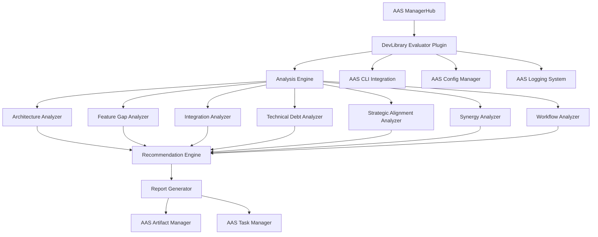

# Design Document

Note: This evaluator now lives under `guild/devlibrary_evaluator/` and is treated
as a Guild module. Plugin references are historical.

## Overview

The DevLibrary Evaluation System is implemented as an AAS plugin that provides comprehensive analysis and recommendation capabilities for the DevLibrary workspace. The system integrates seamlessly with the existing AAS infrastructure, leveraging the ManagerHub, plugin architecture, and CLI systems to deliver actionable insights for project improvement and strategic alignment.

## Architecture

### Plugin Integration Architecture



### Component Architecture

The system follows the AAS plugin pattern with integration into existing managers:

1. **Plugin Entry Point**: Registers with AAS plugin system and ManagerHub
2. **Analysis Engine**: Orchestrates evaluation using AAS configuration and logging
3. **Specialized Analyzers**: Each analyzer leverages AAS infrastructure for consistency
4. **Recommendation Engine**: Generates recommendations aligned with Master Roadmap
5. **Report Generator**: Integrates with AAS artifact management and task systems
6. **CLI Integration**: Extends AAS CLI with evaluation commands

## Components and Interfaces

### DevLibrary Evaluator Plugin

**Purpose**: Main plugin class that integrates with AAS infrastructure and orchestrates the evaluation process.

**AAS Integration**:
- Inherits from AAS BasePlugin class
- Uses ManagerHub for configuration and service access
- Integrates with AAS logging (loguru) for consistent logging
- Leverages AAS task management for progress tracking

**Interface**:
```python
class DevLibraryEvaluatorPlugin(BasePlugin):
    def __init__(self, manager_hub: ManagerHub):
        super().__init__(manager_hub)
        self.config = manager_hub.config
        self.logger = manager_hub.logger
        self.task_manager = manager_hub.tasks
        self.artifact_manager = manager_hub.artifacts

    async def evaluate_workspace(self, workspace_path: Path) -> EvaluationReport
    def get_plugin_info(self) -> PluginInfo
    def get_capabilities(self) -> List[str]
```

### Analysis Engine

**Purpose**: Central orchestrator that manages the evaluation workflow using AAS infrastructure.

**AAS Integration**:
- Uses AAS configuration management for analyzer settings
- Leverages AAS parallel execution capabilities for analyzer coordination
- Integrates with AAS health monitoring for analysis status

**Interface**:
```python
class AnalysisEngine:
    def __init__(self, manager_hub: ManagerHub):
        self.config = manager_hub.config
        self.logger = manager_hub.logger
        self.health_manager = manager_hub.health

    def discover_projects(self) -> List[Project]
    def initialize_analyzers(self) -> Dict[str, Analyzer]
    async def run_analysis(self) -> AnalysisResults
    def track_progress(self, task_id: str, progress: float) -> None
```

### Architecture Analyzer

**Purpose**: Evaluates architectural patterns and consistency across AAS ecosystem projects.

**AAS Integration**:
- Uses AAS project discovery utilities
- Leverages AAS code analysis tools
- Integrates with AAS plugin architecture standards for evaluation

**Interface**:
```python
class ArchitectureAnalyzer(BaseAnalyzer):
    def analyze_aas_architecture(self, aas_path: Path) -> AASArchitectureAnalysis
    def analyze_plugin_compliance(self, plugin_path: Path) -> PluginComplianceReport
    def assess_manager_integration(self, project: Project) -> ManagerIntegrationReport
    def evaluate_ipc_patterns(self, projects: List[Project]) -> IPCPatternReport
```

### Strategic Alignment Analyzer

**Purpose**: Evaluates alignment with AAS Master Roadmap and strategic objectives.

**AAS Integration**:
- Parses Master Roadmap documents using AAS document processing
- Integrates with AAS milestone tracking
- Uses AAS resource allocation data for efficiency analysis

**Interface**:
```python
class StrategicAlignmentAnalyzer(BaseAnalyzer):
    def parse_master_roadmap(self) -> RoadmapStructure
    def assess_project_alignment(self, project: Project) -> AlignmentScore
    def evaluate_milestone_feasibility(self) -> MilestoneFeasibilityReport
    def analyze_resource_allocation(self) -> ResourceAllocationReport
```

### Recommendation Engine

**Purpose**: Generates prioritized recommendations aligned with AAS strategic goals and Master Roadmap.

**AAS Integration**:
- Uses AAS task creation APIs for actionable recommendations
- Integrates with AAS effort estimation utilities
- Leverages AAS risk assessment frameworks

**Interface**:
```python
class RecommendationEngine:
    def __init__(self, manager_hub: ManagerHub):
        self.task_manager = manager_hub.tasks
        self.config = manager_hub.config

    def generate_recommendations(self, analysis_results: AnalysisResults) -> List[Recommendation]
    def create_aas_tasks(self, recommendations: List[Recommendation]) -> List[str]
    def prioritize_by_roadmap(self, recommendations: List[Recommendation]) -> List[PrioritizedRecommendation]
    def estimate_effort_with_aas(self, recommendation: Recommendation) -> EffortEstimate
```

## Data Models

### AAS-Integrated Project Model

```python
@dataclass
class Project:
    name: str
    path: Path
    language: str
    framework: str
    version: str
    dependencies: List[Dependency]
    aas_integration: AASIntegration  # New: AAS-specific integration info
    plugin_compliance: PluginCompliance  # New: Plugin architecture compliance
    manager_usage: List[str]  # New: Which AAS managers are used
    roadmap_alignment: RoadmapAlignment  # New: Master Roadmap alignment
    last_updated: datetime
```

### AAS Integration Model

```python
@dataclass
class AASIntegration:
    is_aas_plugin: bool
    uses_manager_hub: bool
    manager_dependencies: List[str]
    cli_integration: bool
    config_integration: bool
    logging_integration: bool
    task_integration: bool
    artifact_integration: bool
```

### Roadmap Alignment Model

```python
@dataclass
class RoadmapAlignment:
    aligned_phases: List[str]
    supporting_initiatives: List[str]
    blocking_dependencies: List[str]
    strategic_value: StrategicValue
    timeline_compatibility: bool
    resource_requirements: ResourceRequirements
```

### AAS-Enhanced Recommendation Model

```python
@dataclass
class Recommendation:
    id: str
    title: str
    description: str
    category: RecommendationCategory
    aas_task_id: Optional[str]  # New: Generated AAS task ID
    roadmap_phase: str  # New: Which Master Roadmap phase this supports
    manager_impact: List[str]  # New: Which AAS managers are affected
    plugin_impact: List[str]  # New: Which plugins are affected
    implementation_via_aas: bool  # New: Can be implemented using AAS tools
    effort: EffortLevel
    priority: PriorityLevel
    timeline: Timeline
    risks: List[Risk]
    dependencies: List[str]
```

## Correctness Properties

*A property is a characteristic or behavior that should hold true across all valid executions of a system-essentially, a formal statement about what the system should do. Properties serve as the bridge between human-readable specifications and machine-verifiable correctness guarantees.*

### Property 1: AAS Plugin Integration Completeness
*For any* DevLibrary evaluation run, the plugin should successfully integrate with all required AAS managers (ManagerHub, Config, Logging, Tasks, Artifacts) and report integration status.
**Validates: Requirements 1.1, 1.2, 1.3, 1.4, 1.5, 1.6**

### Property 2: Comprehensive Project Analysis
*For any* DevLibrary workspace containing AAS projects, the Analysis Engine should discover and analyze all AAS-compatible projects including plugins, managers, and integration components.
**Validates: Requirements 2.1, 2.2, 2.3, 2.4, 2.5, 2.6**

### Property 3: Master Roadmap Alignment Accuracy
*For any* project in the AAS ecosystem, the Strategic Alignment Analyzer should accurately assess alignment with Master Roadmap phases and provide specific alignment scores and recommendations.
**Validates: Requirements 6.1, 6.2, 6.3, 6.4, 6.5, 6.6**

### Property 4: AAS-Integrated Recommendation Generation
*For any* analysis results, the Recommendation Engine should generate recommendations that integrate with AAS task management, reference Master Roadmap phases, and include AAS-specific implementation guidance.
**Validates: Requirements 7.1, 7.2, 7.3, 7.4, 7.5, 7.6**

### Property 5: Plugin Architecture Compliance Assessment
*For any* AAS plugin or component, the Architecture Analyzer should accurately assess compliance with AAS plugin architecture standards and identify specific compliance gaps.
**Validates: Requirements 2.5, 2.6**

### Property 6: Cross-Project Integration Analysis
*For any* multi-project AAS workspace, the Integration Analyzer should identify all viable opportunities for shared AAS plugins, unified configuration, and improved manager integration.
**Validates: Requirements 4.1, 4.2, 4.3, 4.4, 4.5, 4.6**

### Property 7: AAS Ecosystem Technical Debt Quantification
*For any* AAS codebase with technical debt, the Technical Debt Analyzer should identify, categorize, and quantify debt with specific reference to AAS standards and best practices.
**Validates: Requirements 5.1, 5.2, 5.3, 5.4, 5.5, 5.6**

### Property 8: Feature Gap Identification with AAS Context
*For any* AAS project suite, the Feature Gap Analyzer should identify missing capabilities with specific reference to AAS plugin opportunities and ecosystem enhancement potential.
**Validates: Requirements 3.1, 3.2, 3.3, 3.4, 3.5, 3.6**

### Property 9: AAS Workflow Integration Assessment
*For any* development workflow in the AAS ecosystem, the Workflow Analyzer should identify automation opportunities using existing AAS capabilities and suggest AAS-native improvements.
**Validates: Requirements 9.1, 9.2, 9.3, 9.4, 9.5, 9.6**

### Property 10: AAS-Integrated Report Generation
*For any* evaluation results, the Report Generator should create reports that integrate with AAS artifact management, generate AAS-compatible tasks, and align with Master Roadmap presentation standards.
**Validates: Requirements 10.1, 10.2, 10.3, 10.4, 10.5, 10.6**

## Error Handling

### AAS Integration Errors

**ManagerHub Connection Errors**: When the plugin cannot connect to ManagerHub, it should gracefully degrade to standalone mode with limited functionality and clear error reporting.

**Configuration Access Errors**: When AAS configuration is unavailable, the plugin should use default settings and log configuration limitations clearly.

**Task Manager Integration Errors**: When task creation fails, the plugin should continue generating recommendations but flag task integration failures in the report.

### Analysis Errors with AAS Context

**Plugin Discovery Errors**: When AAS plugins cannot be analyzed due to missing manifests or malformed structure, the system should report plugin-specific issues and continue with available data.

**Manager Integration Analysis Errors**: When manager usage cannot be determined, the system should flag integration assessment limitations and provide partial analysis.

**Roadmap Parsing Errors**: When Master Roadmap documents cannot be parsed, the system should use cached roadmap data or provide alignment assessment limitations.

### Report Generation with AAS Integration

**Artifact Manager Errors**: When reports cannot be stored via AAS artifact management, the system should fall back to local file storage and notify users of the limitation.

**Task Generation Errors**: When AAS tasks cannot be created from recommendations, the system should provide manual task creation instructions and export task data.

## Testing Strategy

### AAS Integration Testing

**ManagerHub Integration**: Tests will verify proper integration with all AAS managers including configuration access, logging integration, and service discovery.

**Plugin Architecture Compliance**: Tests will validate that the evaluator plugin follows AAS plugin standards and integrates correctly with the plugin registry.

**CLI Integration**: Tests will verify proper integration with AAS CLI including command registration, argument parsing, and output formatting.

### Property-Based Testing Configuration

**Framework**: Hypothesis (Python) integrated with AAS testing infrastructure
**Test Configuration**: Minimum 100 iterations per property test, using AAS test fixtures
**Test Tagging**: Format: **Feature: devlibrary-evaluation, Property {number}: {property_text}**

**AAS-Specific Property Tests**:
- Generate AAS plugin structures and verify compliance assessment
- Create Master Roadmap variations and verify alignment analysis
- Generate AAS manager usage patterns and verify integration analysis
- Create multi-project AAS scenarios and verify synergy identification

### Integration with AAS Testing Framework

**Test Data**: Use AAS test fixtures and mock managers for consistent testing
**Coverage Requirements**: 90%+ line coverage with AAS testing standards
**Performance Testing**: Ensure evaluation completes within AAS performance guidelines
**Regression Testing**: Integrate with AAS CI/CD pipeline for automated testing
